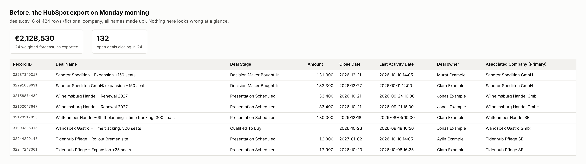
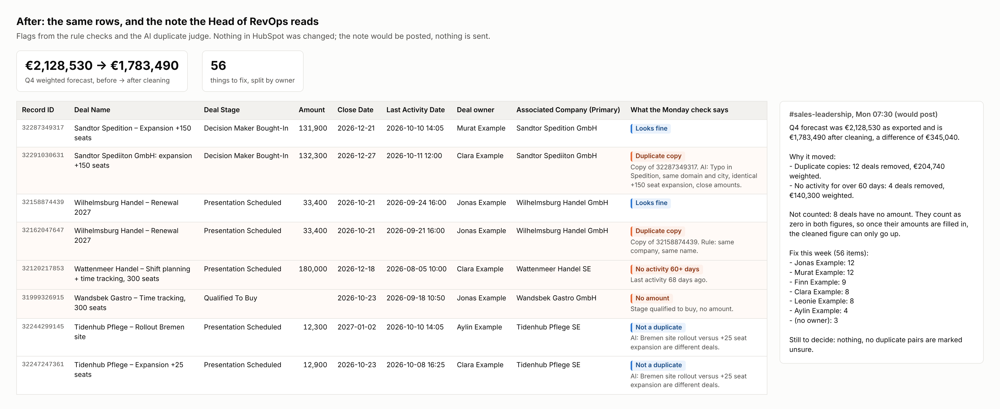
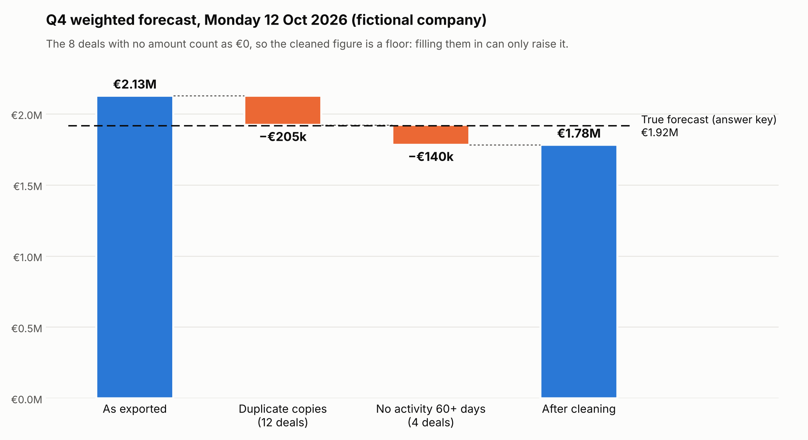
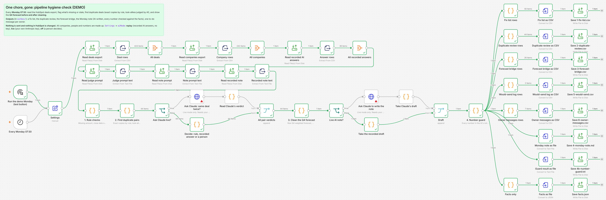
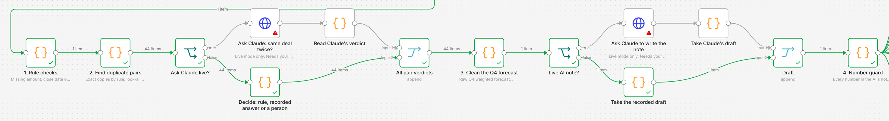

# Pipeline Hygiene Check (demo, changes nothing in HubSpot)

*One chore, gone:* the Monday clean-up of a messy CRM before the forecast call. Duplicate deals, deals nobody has touched in two months and deals with no amount quietly bend the Q4 number. This workflow finds them, shows the forecast before and after, and tells each owner what to fix. Built in [n8n](https://n8n.io), with AI for the two jobs rules do badly.

> **Demo only.** The company "Hafenlicht Example GmbH", its 6 account executives, all 242 customer companies and every number are made up (domains end in `.example`). The workflow reads a HubSpot **export** file. It never connects to HubSpot, changes no record and sends no message: the note and the owner messages are written to files.

## Monday morning, before and after

**Before:** the export says the Q4 weighted forecast is **€2,128,530**. Nothing looks wrong at a glance.



**After the check:** the same rows. A deal entered twice with a typo in the company name ("Sandtor Spediiton"), a double import, a €180,000 deal with no activity for 68 days, a deal with no amount. And two Tidenhub Pflege deals that look alike but are different business, correctly left alone.



**The forecast, cleaned:** €2,128,530 → **€1,783,490**. 12 duplicate copies (€204,740 weighted) and 4 deals with no activity for over 60 days (€140,300) come out.



The honest part is the dashed line. Because the problems were planted, the true forecast is known: **€1,917,010**. The export overstated it by 11 %. The cleaned figure *understates* it by 7 %, because 8 deals have no amount and count as €0. The tool doesn't guess those amounts, so the note says the cleaned figure is a floor, not the answer.

## The chore

A Head of RevOps at a 50–300 person scale-up opens the pipeline report on Monday and doesn't trust it. Someone imported a list twice. Two reps entered the same deal under two spellings of the customer. A big deal has been "Presentation Scheduled" since August. Deals have no amount, no close date, or no owner. Each one is small. Together they move the forecast by six figures, and the CEO notices before RevOps does.

The fix isn't hard, just tedious: export, sort, scan, compare spellings, message each rep. Every week.

## How it works

One workflow, every **Monday at 07:30**:

| Step | What it does |
|---|---|
| **Read** | The HubSpot deals and companies export (HubSpot's own column names), the two AI prompts, and the recorded AI answers. |
| **1. Rule checks** | Open deals with no amount (after the first stage), no close date or no owner; a close date in the past; no activity for 31–60 days ("stale") or over 60 days; closed won with a close date in the future. |
| **2. Find duplicate pairs** | **Exact copies by rule:** same company record, same deal name. **Look-alikes:** similar company (same record, same domain, or a name similarity of 0.80 or more after removing "GmbH", "AG" and so on), amounts within 25 %, created within 90 days. Each look-alike pair goes to the AI judge. |
| **AI judge** | Reads the two deals and their companies and answers DUPLICATE, DIFFERENT or UNSURE with a one-line reason. UNSURE goes to a person and is never counted as a duplicate. |
| **3. Clean the Q4 forecast** | Q4 weighted forecast (amount × HubSpot's stage probability, open deals closing in Q4), minus duplicate copies, minus deals with no activity for 60+ days. Writes the fix list, the duplicate review, the forecast bridge, the owner messages and a facts file. |
| **AI note** | Writes the Monday note for #sales-leadership from the facts file only. |
| **4. Number guard** | Every number in the AI's note must appear in the facts file (euro amounts as euro amounts, percentages as percentages). If one doesn't, the AI note is thrown away and a plain template note is used. |



The main row up close, with the number of items passing through each step:



**Three AI modes**, set in the `Settings` step: `replay` uses the recorded answers in [`data/ai/`](data/ai/) (no key needed, the default), `live` calls the AI API with your own Anthropic API key, and `off` sends every look-alike pair to a person and uses the template note. The two globe steps with a red mark are the live-mode API calls: they only run in `live` mode and need your key, so the mark just means "no credential yet".

**What the outputs look like** (all in `data/outbox/`): `1-fix-list.csv` (56 rows, by owner), `2-duplicate-review.csv` (44 pairs with the verdict and reason), `3-forecast-bridge.csv` (every deal that moved the number), `4-monday-note.md`, `4b-number-guard.txt`, `5-would-send.csv`, `6-owner-messages.csv` and `facts.json`. One owner message:

> *Hi Jonas, 12 things in HubSpot need you before this week's forecast call:*
> *- Wandsbek Gastro – Time tracking, 300 seats: Add the amount (it counts as €0 in the forecast until then)*
> *- Lindenhof Handel – Expansion +60 seats: No activity for over 60 days: close it as lost, or prove it's alive*
> *- Wilhelmsburg Handel – Renewal 2027: Looks like a second copy of another deal: merge it into the original*
> *…*

## The test: planted problems, rules written down before it ran

A tool that says "I found 56 problems" proves nothing unless you know what was there. So I planted the problems myself, and **wrote the rules of the test down before any code or data existed**: [`test/PREREGISTRATION.md`](test/PREREGISTRATION.md) fixes the seed (20261012), every planted problem and its count, the check rules, the metrics and the 20 extra seeds. Its SHA-256 hash and the time (6 Oct 2026, 18:18) are in [`PREREGISTRATION.lock.txt`](test/PREREGISTRATION.lock.txt), it's the first commit in this demo's history, and it hasn't been edited since. Later changes are listed in [`test/AMENDMENTS.md`](test/AMENDMENTS.md) (none changed the result).

**The data:** 400 clean deals (110 won, 90 lost, 200 open) for about 230 companies, then 38 planted rule problems, 18 planted duplicates (8 exact, 10 messy) and **6 look-alike traps**: two real deals at the same company with similar amounts but different business ("Rollout Bremen site" vs "Shift planning + time tracking, 120 seats"). The traps test whether the check flags things it shouldn't.

**The AI judge was blind.** I wrote the generator and know where the traps are, so I couldn't be the judge. The 36 look-alike pairs went to a separate AI run (a blind AI judge) that was given only the 36 prompts and told not to open anything else. Its answers are recorded word for word in [`data/ai/duplicate-verdicts.csv`](data/ai/duplicate-verdicts.csv). The Monday note was written the same way, from the facts file only.

**Results on the primary seed:**

| Check | Planted | Caught | False flags |
|---|---|---|---|
| Rule checks (7 kinds: missing amount, close date, owner; past close date; stale; 60+ days; won with future date) | 38 | **38** | **0** |
| Exact duplicates (rule) | 8 | **8** | 0 |
| Messy duplicates (AI judge, 36 pairs judged) | 10 | **10** | **0** |
| Look-alike traps flagged as duplicates | 6 traps | – | **0 of 6** |

**What the AI adds**, on the same 36 pairs. Without AI, a reasonable rule ("company name similarity at least 0.85, or same record or domain, and amounts within 10 %") would have:

| Duplicates | Caught (of 18) | Wrong pairs flagged | of which traps |
|---|---|---|---|
| Rules only | 17 | **13** (11 real deals) | 6 of 6 |
| Rules + AI judge | **18** | **0** | 0 of 6 |

Those 13 pairs would flag 11 real deals as copies: 11 reps told to merge a real deal away, and the 6 of those deals that close in Q4 wrongly taken out of the forecast. That's the part rules do badly: "Renewal 2027" and "Expansion +40 seats" at the same company with similar amounts look like one deal to a rule, and like two to anyone who reads the names.

**The forecast:**

| Q4 weighted forecast | € | vs true |
|---|---|---|
| As exported | 2,128,530 | +211,520 (+11.0 %) |
| Cleaned by the check | 1,783,490 | −133,520 (−7.0 %) |
| True (from the answer key) | 1,917,010 | |

The cleaned number is closer, but **it's low, not right**: the whole gap is the 8 deals without an amount. That's why the note says the cleaned figure "can only go up" (a sentence the code writes, not the AI), and why "add the amount" comes first in the message of every owner who has such a deal.

**On 20 other seeds** (20261013–20261032, decided in advance; median and range, never used to pick a result):
- Rule checks: 38 of 38 caught, 0 false flags, on every seed.
- Messy duplicates that reached the AI step at all: median **9 of 10** (8–10). Over all 20 seeds, 17 of 200 never reached it (see below).
- Rules-only duplicates: median 8.5 of 10 messy ones caught, **8.5 wrong pairs per run** (5–13), including 4 of the 6 traps (2–6).
- How far the export was off the truth: median +9.8 % (+0.9 % to +21.5 %).
- The AI judge ran on the primary seed only (said so in advance), so there is no AI score for the other 20.

**n8n and Python give identical results.** The checks run as n8n steps, and the same logic exists as a plain-Python copy. Every output file was compared cell by cell: identical in replay, live and off mode, in off mode on 5 more seeds, when the number guard rejects a note, and when the workflow runs twice. Live mode was tested against a local stand-in for the Anthropic API (I had no key in the test environment), which checked all 74 requests. Details: [`test/n8n-checks.txt`](test/n8n-checks.txt).

**Time saved:** not measured. I haven't timed a real Monday clean-up with a stopwatch, so I'm not putting a number on it.

## What this test can't show

- **I wrote both sides.** I knew the planted problem types when I wrote the rules, so 38 of 38 for the rule checks is expected and says little. The numbers that matter are the false flags, the duplicate step (messy variants, blind AI) and the forecast gap.
- **It's synthetic.** Real CRMs have problems I didn't think to plant: merged accounts, deals in the wrong pipeline, currency mix-ups, amounts in the wrong field.
- **The AI judged 36 pairs once.** That's a small sample. A different run could answer differently, which is why the answers are recorded and replayable.
- **The number guard has a known limit:** it checks that a number exists in the facts, not that it sits next to the right name. Swapping two owners' counts would pass (it's one of the 9 guard tests).

## What I'd change next (proposed, not applied)

1. **Catch "same name plus a city" and abbreviations.** All 17 messy duplicates that never reached the AI across the other seeds were names like "Deichgraf Hotels Lüneburg" or "Sandtor Rei. AG", scoring 0.67–0.79 against the 0.80 cut-off with no shared domain. Lowering the cut-off to 0.70 would get 197 of 200 there, but triples the AI calls (median 38 → 109 per run). A narrow rule is better: after removing the legal form, one name is the other plus a city or an abbreviated word.
2. **Give the missing amounts a range instead of €0.** Show "8 deals without an amount; at the median amount for their stage, about €X" next to the floor, clearly marked as an estimate.
3. **Write fixes back only after a person approves them**, like the supplies demo's review sheet: merge, close as lost, or add an amount, one approved line at a time.

Each would need a new pre-registered test.

## Try it yourself

### In n8n
I built and tested this on **n8n 2.42**, which needs **Node.js 24** if you run it with `npx n8n`. It also runs in the official Docker image: no Python and no special settings needed.

1. **Start n8n** and open it (usually http://localhost:5678).
2. **Put the files where n8n can read them.** Recent n8n versions only let file steps use a folder called `.n8n-files` in the home folder of the user running n8n. Create:
   ```
   .n8n-files/
   └── pipeline-hygiene-demo/
       ├── export/     ← deals.csv and companies.csv from data/export/
       ├── ai/         ← duplicate-verdicts.csv and weekly-note.md from data/ai/
       ├── prompts/    ← the 2 files from prompts/
       └── outbox/     ← empty; the results are written here
   ```
3. **Check the folder path.** The `Settings` step points to `/home/node/.n8n-files/pipeline-hygiene-demo`, the home folder in the official Docker image. If you run n8n another way, change `folder` in `Settings` to your own path (for example `/Users/yourname/.n8n-files/pipeline-hygiene-demo`). It's the only place the path appears.
4. **Import:** Workflows → Import from File → `workflow/pipeline-hygiene.workflow.json`.
5. **Run it.** Open the small menu next to **Execute workflow**, choose **Run the demo Monday (test button)**, then click **Execute workflow**. Eight files appear in `outbox/`, the same as in [`data/outbox/`](data/outbox/).
6. **Optional, live AI:** create a **Header Auth** credential whose header **Name** is `x-api-key` and whose **Value** is your Anthropic API key, select it in the two live AI steps ("Ask AI: same deal twice?" and "Ask AI to write the note"), and set `aiMode` to `live` in `Settings`. That sends 36 short prompts and one longer one per run.

The schedule trigger uses the real date. The test button pins "now" to Monday 12 Oct 2026, 07:30, so the demo data always gives the results above.

### In Python (the reference copy and the test)
Python 3, standard library only. From `workflow/`:
```
python3 run_weekly.py                  # the weekly check, replay mode -> ../data/outbox/
python3 run_weekly.py --ai off         # no AI
python3 run_weekly.py --ai live        # needs ANTHROPIC_API_KEY (model in AI_MODEL, default claude-sonnet-5-5)
python3 score.py                       # score the outbox against the answer key
python3 robustness.py                  # the 20 other seeds
python3 test_number_guard.py           # 9 notes the guard should pass or reject
python3 compare_outboxes.py A B        # compare two outbox folders file by file
python3 generate_export.py             # rebuild the fake export and answer key (seed 20261012)
```
The pictures are made by `make_before_after.py` (needs Playwright) and `make_bridge_chart.py` (needs matplotlib).

## What's in this folder

| Path | What it is |
|---|---|
| `workflow/pipeline-hygiene.workflow.json` | The n8n workflow (import this) |
| `workflow/*.py` | The Python reference copy, the data generator and the test scripts |
| `prompts/` | The two AI prompts, locked with the pre-registration |
| `data/export/` | The fake HubSpot export (input) |
| `data/ai/` | The blind AI's recorded answers, and the 36 prompts it saw |
| `data/outbox/` | Example output of one run |
| `test/` | Pre-registration, lock, code hashes, answer key, results, amendments, n8n checks |
| `screenshots/` | The images above |
| `build-story.md` | How I built it, what broke, and the fixes |
