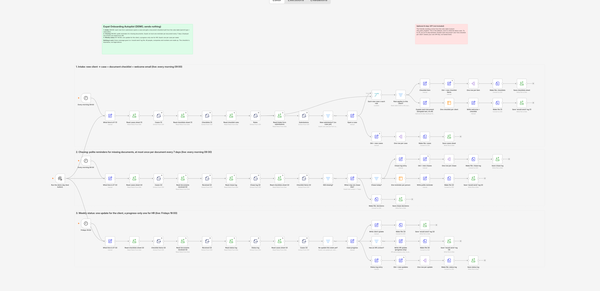
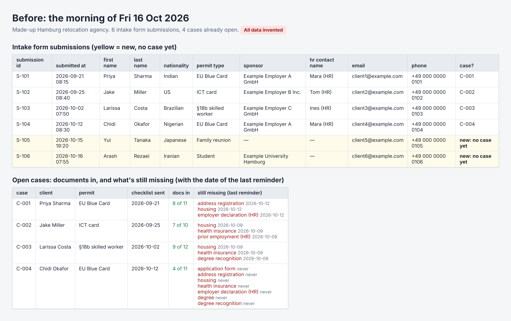
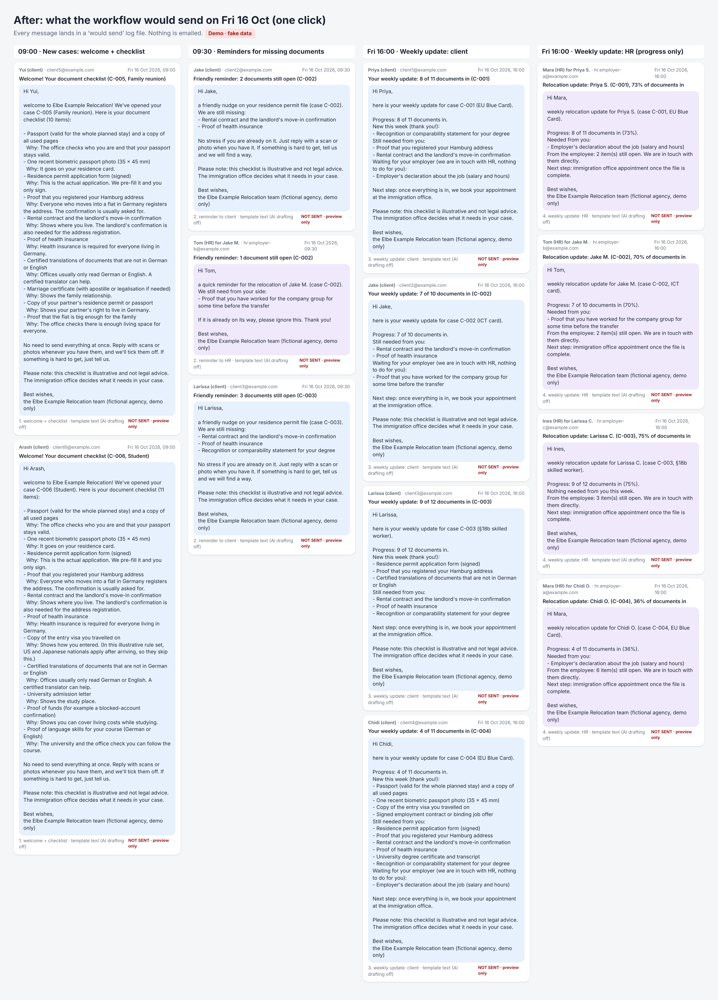
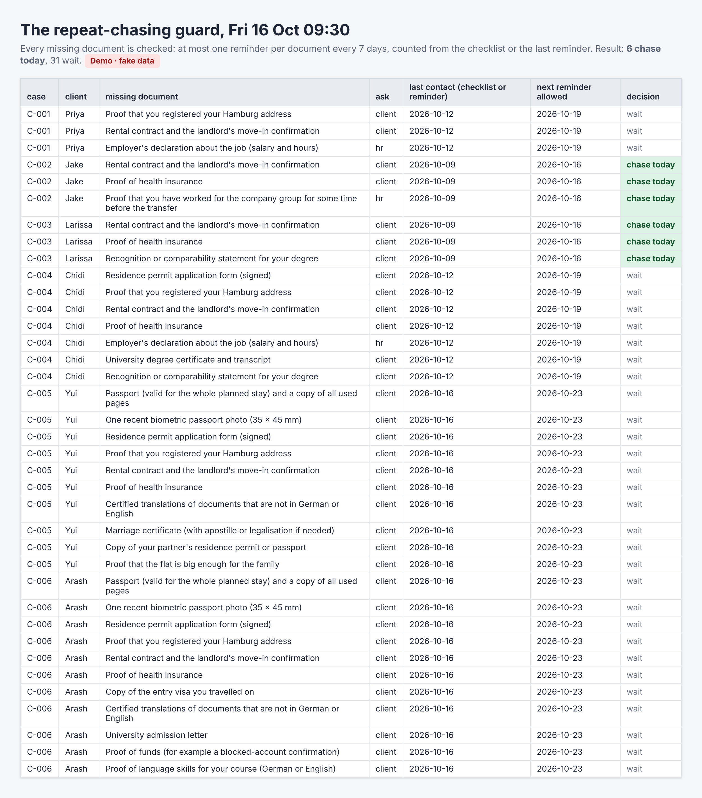
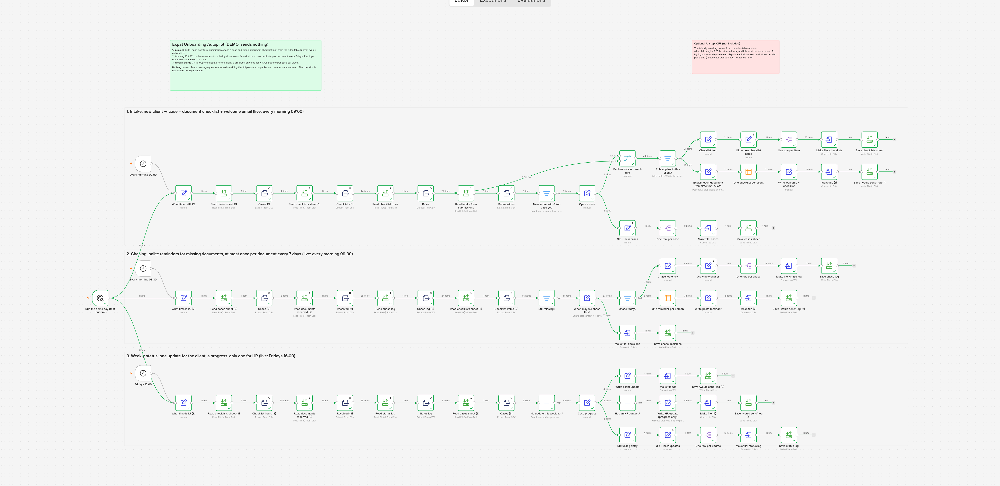
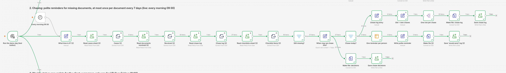

# Expat Onboarding Autopilot (demo, sends nothing)

*One chore, gone:* document checklists, polite reminders and weekly status updates for a small relocation agency, built in [n8n](https://n8n.io).

> **Demo only.** The agency ("Elbe Example Relocation"), the six clients, their employers and HR contacts are all made up. The workflow has no email, SMS, chat or web-request step at all. Every message goes into a "would send" log file instead.
>
> **Not legal advice.** The document checklist comes from a small, made-up rules table. It's generic and plausible, but illustrative only and not checked against official requirements. Every client message says so.

## The chore

A relocation agency helps people move to Hamburg for a job, a study place or to join their family. Each new client needs a residence permit, and each permit needs a stack of documents. Which ones depends on the permit type and sometimes on the person's nationality.

So someone builds a checklist by hand for every new client. Then the documents trickle in over weeks. Someone keeps track of what's missing, writes "could you send…?" emails, and tries not to nag the same person twice in a week. On Fridays, the client wants to know where things stand, and so does HR at their new employer. HR should hear about progress, not about the client's marriage certificate.

## How it works

One workflow with three checks:

| When | What it looks at | What it writes |
|---|---|---|
| Every morning **09:00** | Intake form submissions that **don't have a case yet** | Opens a case, builds the document checklist from the rules table (permit type + nationality), and writes a welcome email listing each document and why it's needed. |
| Every morning **09:30** | Checklist documents that **haven't arrived** | One polite reminder per person with the documents that are due. Documents the employer provides are asked from HR, not the client.<br>**At most one reminder per document every 7 days**, counted from the checklist or the last reminder. |
| **Fridays 16:00** | Open cases **without an update this week** | A weekly update for the client (what came in, what's still needed) and a **progress-only** update for HR: percentage, what HR needs to send, and only a *count* of the employee's open items. |

The rules table (`data/checklist-rules.csv`) is the single source of truth: 22 rows saying which permit types and nationalities need which document, who provides it, and one plain-English sentence on why it's needed. Change the table and the checklists change. No need to touch the workflow.

Each check keeps a small memory, so running it again doesn't repeat itself: a case is opened once per form submission, every reminder goes into a chase log, and every weekly update into a status log.



## Before and after

**Before:** the morning of Friday 16 Oct 2026 (the demo's fixed "today"). Six form submissions, two of them new. Four cases are already open, with documents missing and the date each one was last chased.



**After:** one click on "Run the demo day" runs all three checks and writes **13 messages**: 2 welcome emails with checklists (Yui and Arash), 3 reminders covering 6 documents (Jake, Jake's HR contact, Larissa), 4 weekly client updates and 4 weekly HR updates.



**The repeat-chasing guard:** 37 documents are missing on the demo day. 6 are due for a reminder; 31 are not, because they were chased on 12 Oct or their checklist only went out this week.



The test run in n8n, with the number of items passing through each step (the whole demo day took about 1.3 seconds), and a close-up of the chasing check:





**Time saved:** not measured yet. I haven't timed the manual version with a stopwatch, so I'm not putting a number on it.

## Try it yourself

You need a recent version of n8n. I built and tested this on **n8n 2.41**, which needs **Node.js 24** if you run it with `npx n8n`.

1. **Start n8n** and open it in your browser (usually http://localhost:5678).
2. **Put the sample data where n8n can read it.** Recent n8n versions only let file steps read and write inside a folder called `.n8n-files` in the home folder of the user running n8n. Create this inside it:
   ```
   .n8n-files/
   └── expat-demo/
       ├── intake-form-submissions.csv   ← copy from data/
       ├── checklist-rules.csv           ← copy from data/
       ├── documents-received.csv        ← copy from data/
       ├── state/                        ← copy the 4 files from data/state/ (the sheets the workflow reads and updates)
       └── outbox/                       ← empty folder; the log files are written here
   ```
3. **Check the file paths.** All file steps point to `/home/node/.n8n-files/expat-demo/…`, which is the home folder inside the official n8n Docker image. If you run n8n another way, open `workflow/expat-onboarding.workflow.json` in a text editor and replace `/home/node` with your own home folder everywhere (for example `/Users/yourname` on a Mac). It's one find-and-replace.
4. **Import the workflow:** Workflows → Import from File → `workflow/expat-onboarding.workflow.json`.
5. **Pick the test button, then run.** With several triggers, n8n's **Execute workflow** button starts "from Every morning 09:00" by default, which runs only the intake check. Open the small menu next to the button, choose **Run the demo day (test button)**, then click **Execute workflow**. Five files appear in `outbox/`:
   - `1-welcome-checklists.csv` (2 messages)
   - `2-document-reminders.csv` (3 messages)
   - `2b-chase-decisions.csv` (37 lines: every missing document and whether it was chased)
   - `3-weekly-client-updates.csv` (4 messages)
   - `4-weekly-hr-updates.csv` (4 messages)

   You can compare them with the expected output in [`data/outbox/`](data/outbox/).

**Run it a second time** and you get no new messages: no new cases, no reminders, no weekly updates. That's the guard working. To start over, copy the four files from `data/state/` into `state/` again.

To play with it, add a row to `intake-form-submissions.csv` (a new client), add a row to `documents-received.csv` (a document arriving), or change a rule in `checklist-rules.csv`.

## Files

| File | What it is |
|---|---|
| `workflow/expat-onboarding.workflow.json` | The n8n workflow. Import this. |
| `data/intake-form-submissions.csv` | Six fake intake form submissions (nationalities: Indian, US, Brazilian, Nigerian, Japanese, Iranian; permits: EU Blue Card, ICT card, §18b skilled worker, family reunion, student) |
| `data/checklist-rules.csv` | The rules table: which document is needed for which permit and nationality, who provides it, and why (illustrative) |
| `data/documents-received.csv` | Which documents arrived and when |
| `data/state/` | The sheets on the morning of the demo day: cases, checklists, chase log, status log. I didn't type these by hand: I ran the workflow once per simulated day from 21 Sep to 15 Oct, starting with empty sheets. |
| `data/outbox/*.csv` | Expected output: the "would send" log from the demo run |
| `screenshots/` | The images above |
| `build-story.md` | How I built it, the bugs that made checks quietly do nothing, and the fixes |

## Limits (on purpose)

This is a demo, not a product. It does **not**:

- **send anything.** There is no sending step in the workflow.
- **receive anything.** Documents "arrive" when you add a row to `documents-received.csv`.
- **know the real requirements.** The rules table is made up and illustrative, not legal advice. A real agency would keep its own table and check it against current official sources.
- **use AI.** The friendly explanation for each document comes from the rules table. That's the fallback, and it's what the demo uses, so no API key is needed. The canvas marks where an optional AI step could go; none is included or tested.
- **check document quality.** A blurry scan counts as received.
- **stop or escalate.** Reminders keep coming every 7 days. A real version should hand the case to a person after a few tries.
- **group HR emails.** An HR contact with two employees gets two updates.
- **use the real clock.** Each check has a "What time is it?" step with a fixed demo time, so the result is always the same.

## What going live would need (not built here)

- Switch the three "What time is it?" steps to the real time (`{{ $now.toISO() }}`).
- Replace the intake CSV with a real form (n8n has a Form trigger), and the CSV sheets with a real spreadsheet or database.
- Replace the "Save 'would send' log" steps with a real email step, plus consent and a proper data-protection (GDPR) check. The data is personal: passports, family status, finances.
- A person who reviews the rules table regularly, and a way to mark a received document as unusable.
