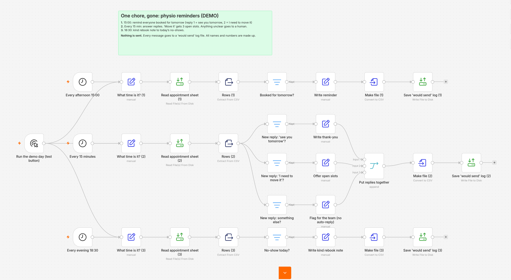
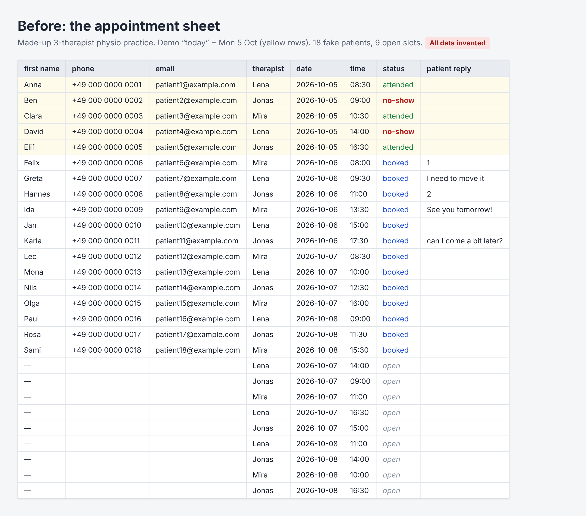
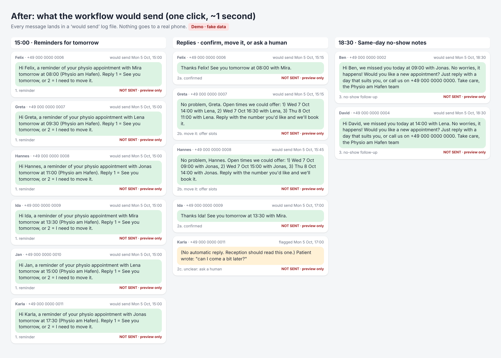
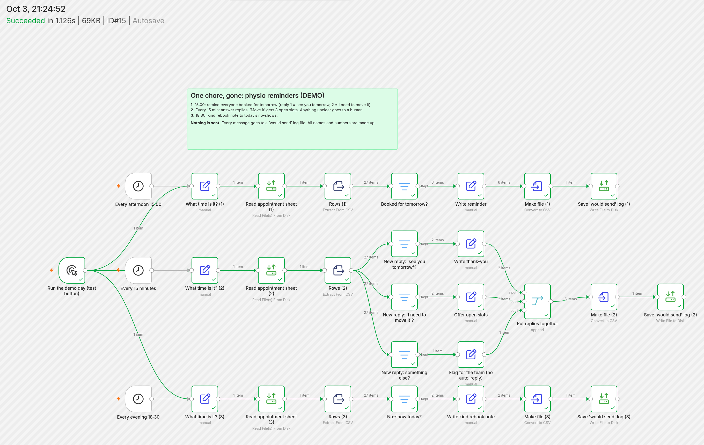

# Physio appointment reminders (demo, sends nothing)

*One chore, gone:* reminders, replies and no-show follow-ups for a small physio practice, built in [n8n](https://n8n.io).

> **Demo only.** The practice ("Physio am Hafen"), the therapists and all 18 patients are made up. The workflow has no email, SMS, WhatsApp or web-request step at all. Every message goes into a "would send" log file instead.

## The chore

Picture a practice with three therapists and one shared appointment sheet. Every afternoon someone goes through tomorrow's bookings one by one: find the row, copy the number, type "Hi Felix, see you tomorrow at 8…", send, tick it off. Then the replies come in during treatments: "yes", "can we move it?", "can I come a bit later?". Each one needs an answer, and moving a booking means hunting for a free slot. When someone doesn't show up, the kind thing is to message them the same day and offer a new time. On a busy day, that's the first thing to get skipped.

## How it works

One workflow with three checks:

| When | What it looks at | What it writes |
|---|---|---|
| Every afternoon at **15:00** | Appointments booked for **tomorrow** | A reminder: "Reply 1 = See you tomorrow, or 2 = I need to move it." |
| Every **15 minutes** | Replies that came in **since the last check** | `1` or "see you tomorrow" → a short thank-you.<br>`2` or "move it" → the next 3 open slots, same therapist first.<br>Anything else → flagged for a person, no automatic reply. |
| Every evening at **18:30** | Appointments marked **no-show today** | A kind note offering to rebook. |

Each message is saved to a "would send" log with who it's for, when it would go out, and the text.



## Before and after

**Before:** the appointment sheet. The demo pretends "today" is Monday 5 Oct 2026, so the same sheet always gives the same result.



**After:** one click on "Run the demo day" runs all three checks and writes 13 messages: 6 reminders, 2 thank-yous, 2 slot offers, 1 reply flagged for staff, and 2 no-show notes. Each is stamped with the time it would go out in real life.



The test run in n8n, with the number of items passing through each step (the whole demo day took about 1.1 seconds):



**Time saved:** not measured yet. I haven't timed the manual version with a stopwatch, so I'm not putting a number on it.

## Try it yourself

You need a recent version of n8n. I built and tested this on **n8n 2.41**, which needs **Node.js 24** if you run it with `npx n8n`.

1. **Start n8n** and open it in your browser (usually http://localhost:5678).
2. **Put the sample data where n8n can read it.** Recent n8n versions only let file steps read and write inside a folder called `.n8n-files` in the home folder of the user running n8n. Create this inside it:
   ```
   .n8n-files/
   └── physio-demo/
       ├── appointments.csv     ← copy from data/appointments.csv
       └── outbox/              ← empty folder; the log files are written here
   ```
3. **Import the workflow:** Workflows → Import from File → `workflow/physio-reminders.workflow.json`.
4. **Check the file paths.** The three "Read appointment sheet" steps and the three "Save 'would send' log" steps point to `/home/node/.n8n-files/physio-demo/…`, which is the home folder inside the official n8n Docker image. If you run n8n another way, change `/home/node` to your own home folder in those six steps (for example `/Users/yourname` on a Mac).
5. **Click "Execute workflow".** Three files appear in `outbox/`:
   - `1-reminders.csv` (6 lines)
   - `2-reply-handling.csv` (5 lines)
   - `3-no-show-followups.csv` (2 lines)

   You can compare them with the expected output in [`data/outbox/`](data/outbox/).

To play with it, edit `appointments.csv` and run it again. For example: add a `booked` row for 2026-10-06 (the demo's "tomorrow"), type a reply in `patient_reply` with a time between 15:00 and 17:00 on 2026-10-05 in `reply_received_at` (the demo's reply window), or mark a 2026-10-05 appointment as `no-show`.

## Files

| File | What it is |
|---|---|
| `workflow/physio-reminders.workflow.json` | The n8n workflow. Import this. |
| `data/appointments.csv` | The fake appointment sheet: 18 made-up patients, 9 open slots, and columns for the patient's reply and when it arrived |
| `data/outbox/*.csv` | Expected output: the "would send" log from the demo run |
| `screenshots/` | The four images above |
| `build-story.md` | How I built it, the bug that would have thanked patients over and over, and the fix |

## Limits (on purpose)

This is a demo, not a product. It does **not**:

- **send anything.** There is no sending step in the workflow.
- **receive replies.** In the demo, replies are typed into the sheet by hand.
- **book or hold the slot** a patient picks. A person still does that. Because slots aren't held, two patients could be offered the same one.
- **use the real clock.** Each check has a "What time is it?" step with a fixed demo time, so the result is always the same.
- **understand free text.** Reply matching is simple: `1`, "yes" or "see you tomorrow" counts as a confirmation; `2` or anything containing "move" counts as a request to move. Everything else goes to a person.
- **catch late bookings.** A booking for tomorrow made after the 15:00 check gets no reminder.

## What going live would need (not built here)

- Switch the three "What time is it?" steps to the real time (`{{ $now.toISO() }}`) and set "minutes since last check" to 15. The demo uses 120 so that one click catches all of the day's replies.
- Replace the "Save 'would send' log" steps with a real SMS or email step. That means a paid provider, the patients' consent, and a proper data-protection (GDPR) check.
- A way to get patient replies into the sheet. Most SMS tools can do this.
- A person who confirms the slot the patient picks.
