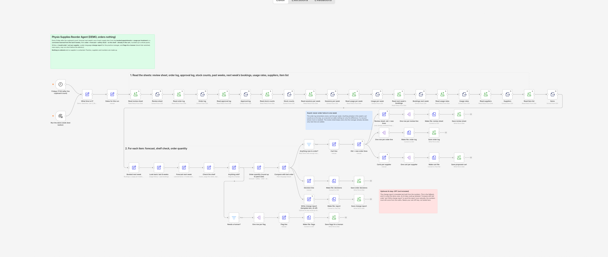
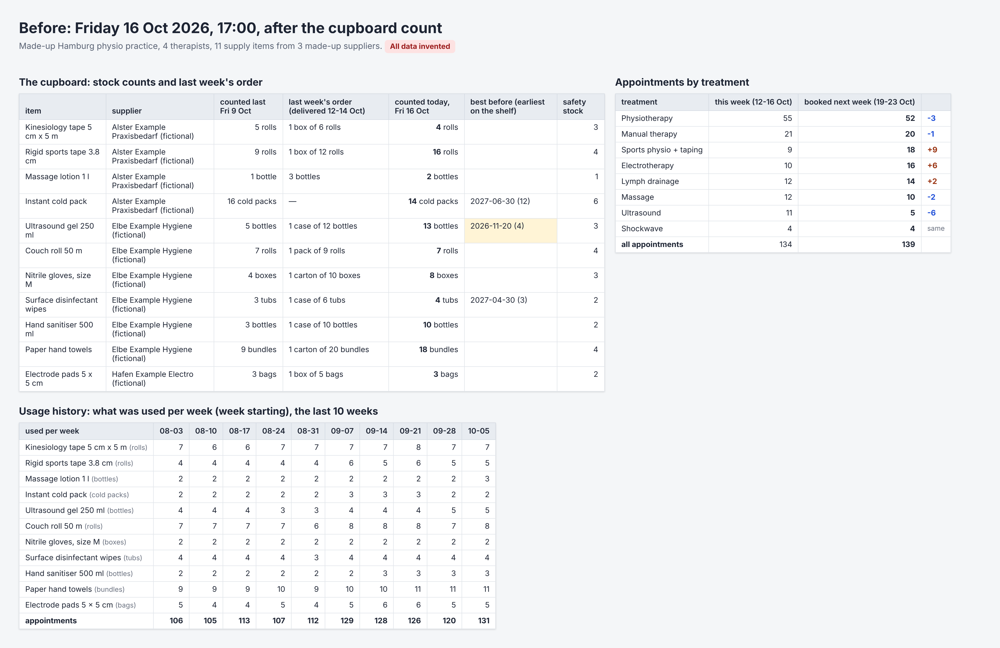
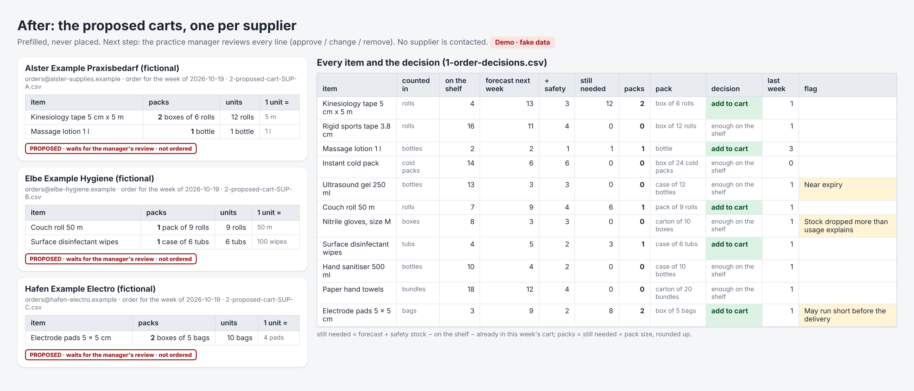
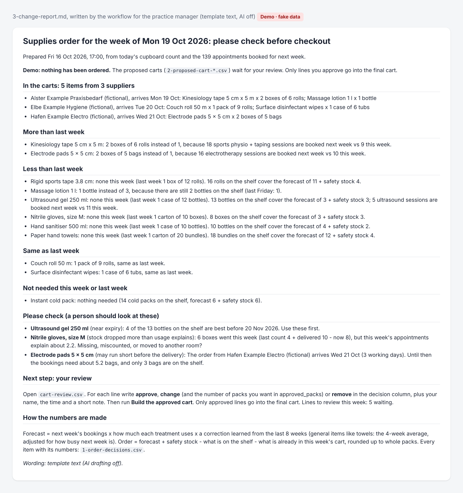
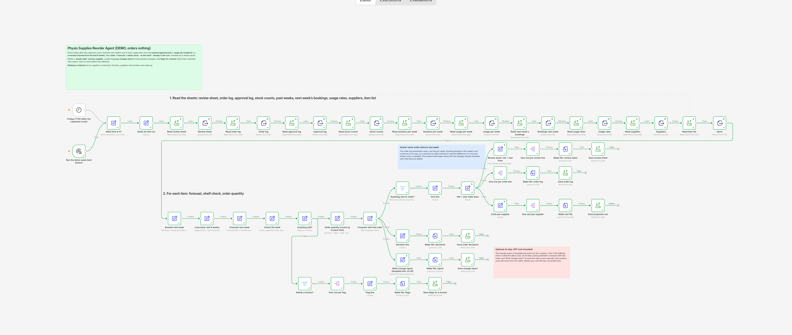
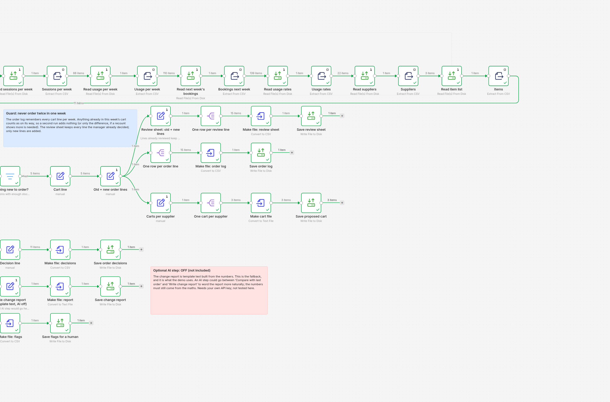
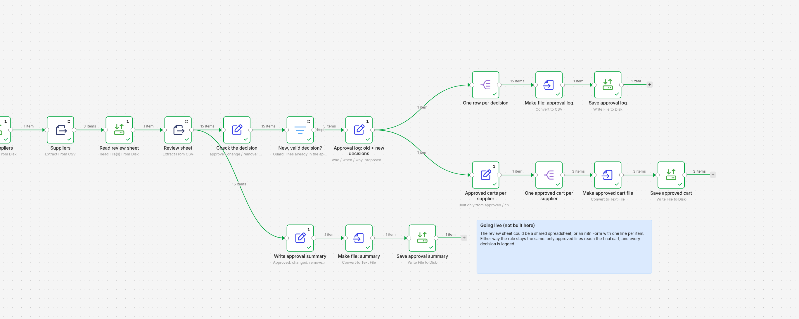
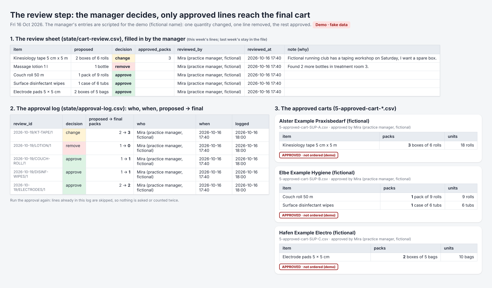
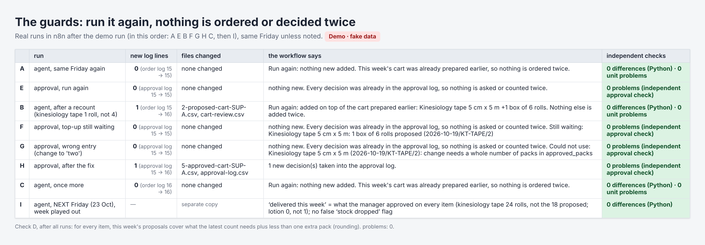
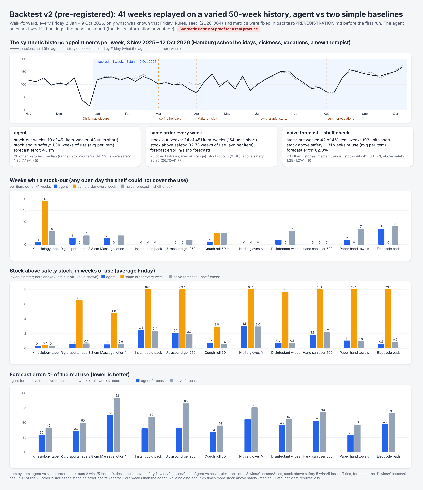

# Physio Supplies Reorder Agent (demo, orders nothing)

*One chore, gone:* the Friday supply count, the "how much do we need next week?" guess and the order list for a small physio practice, built in [n8n](https://n8n.io). The practice manager reviews every line before the cart is final.

> **Demo only.** The practice, its 4 therapists, the practice manager "Mira", the 3 suppliers ("Alster Example Praxisbedarf", "Elbe Example Hygiene", "Hafen Example Electro") and every number are made up. Neither workflow has an email, web-request or shop step, and neither contacts a supplier. They write carts as files, and a person reviews them. No patient data is used: bookings only have date, time, therapist and treatment type.

## The chore

Every Friday, the practice manager walks to the supply cupboard and counts: kinesiology tape, rigid tape, ultrasound gel, couch roll, disinfectant wipes, gloves, electrode pads, massage lotion. Then comes the guess: how much will we need next week? Then the order goes out to two or three suppliers.

Sometimes the tape runs out on Wednesday, because twice as many sports-taping sessions were booked. Sometimes the shelf overflows and gel expires, because the order was "same as last week" while half the ultrasound sessions were gone. And when a box of gloves quietly disappears, nobody notices until the shelf is empty.

## How it works

Two small workflows, every **Friday**.

**1. The reorder agent (17:00, after the count)**

| Step | What it does |
|---|---|
| **Read** | Today's stock count and last Friday's, the item list (what each item is counted in, the pack, supplier, lead time, safety stock), next week's bookings, how much each treatment uses, 10 weeks of usage history, and the order log, review sheet and approval log. |
| **Forecast** | Most items: next week's bookings × usage per treatment × a **correction learned from the last 8 weeks** (what was really used ÷ what the table predicted, kept between 0.8 and 1.5). General items like paper towels: the **4-week average**, scaled by how busy next week is. Rounded up to whole units. |
| **Order** | **Forecast + safety stock − on the shelf − already proposed for this week**, rounded up to whole packs. Items with enough stock are skipped. |
| **Proposed carts** | One **proposed cart per supplier** (a CSV file), and one row per line in the **review sheet**. Nothing is ordered. |
| **Report** | A plain-language **change report** for the practice manager, compared with last week's approved order, plus **flags for a person**: stock that dropped more than the bookings explain, items close to their best-before date, and items that may run out before the delivery arrives. |

**2. Manager review → approved cart (18:00, after the review)**

The manager writes **approve**, **change** (with the number of packs) or **remove** next to each line of the review sheet, plus name, time and a short reason (the reason is required for change and remove). The second workflow checks every new decision, writes it to an **approval log** (who, when, why, proposed → final), and builds the **approved cart per supplier from approved and changed lines only**. Wrong entries are listed as problems and not used. Lines without a decision wait.

**The guards:** every proposed line goes into an order log with the week it's for, so running the agent again on the same Friday adds nothing (or only a top-up if a recount shows less on the shelf). Decided lines are never asked again, and running the approval again changes nothing. "Delivered this week" comes from what the manager approved, not from what the agent proposed.



## Before and after

**Before:** Friday 16 Oct 2026, 17:00 (the demo's fixed "now"). The cupboard counts, last week's order, the bookings by treatment (18 sports-taping sessions next week vs 9 this week, 5 ultrasound vs 11) and the usage history.



**After the agent:** **5 proposed lines in 3 carts**, 6 items skipped because the shelf covers them.



**The change report** the practice manager reads before the review. Some lines from it:

- *"Kinesiology tape 5 cm x 5 m: 2 boxes of 6 rolls instead of 1, because 18 sports physio + taping sessions are booked next week vs 9 this week."*
- *"Ultrasound gel 250 ml: none this week (last week 1 case of 12 bottles). 13 bottles on the shelf cover the forecast of 3 + safety stock 3; 5 ultrasound sessions are booked next week vs 11 this week."*
- *"Nitrile gloves, size M (stock dropped more than usage explains): 6 boxes went this week (last count 4 + delivered 10 - now 8), but this week's appointments explain about 2.2. Missing, miscounted, or moved to another room?"*
- *"Electrode pads 5 x 5 cm (may run short before the delivery): The order from Hafen Example Electro (fictional) arrives Wed 21 Oct (3 working days). Until then the bookings need about 5.2 bags, and only 3 bags are on the shelf."*

Every item has one counting unit and one pack, used the same way everywhere: electrode pads are counted in **bags** (1 bag = 4 pads) and ordered in **boxes of 5 bags**. A small checker reads every output file and complains when a number is followed by another item's word or a mixed-up unit. (The first version said "2 boxes of 5 bags" in one place and "5.2 bags of 4" in another; [build-story.md](build-story.md) has the details.)



The agent's test run in n8n, with the number of items passing through each step (about 1.8 seconds), and a close-up of the second row:





## The review step

In the demo, a script plays the manager so the whole thing runs without a person: kinesiology tape **changed from 2 to 3 boxes** ("Fictional running club has a taping workshop on Saturday, I want a spare box."), massage lotion **removed** ("Found 2 more bottles in treatment room 3."), the other 3 lines approved. The approval workflow logs all 5 decisions and builds **approved carts with 4 lines**.





The full approval canvas is in [`screenshots/08-review-step-in-n8n.png`](screenshots/08-review-step-in-n8n.png).

**The guards, tested:** real runs in n8n, in this order. Agent again: 0 new lines, nothing re-asked. Approval again: 0 new log lines, approved carts identical. Kinesiology tape recounted (1 roll instead of 4): exactly one top-up line, waiting for review and not in the approved cart. A wrong entry ("change" to "two"): listed as a problem, not used. Fixed and approved: the approved tape goes from 3 to 4 boxes. The agent on the *next* Friday: "delivered" equals what was approved on every item. After every agent run, a separate plain-Python copy of the maths matched n8n on all 11 items, and an independent check confirmed every approved line after every approval run.



## Backtest: a fair re-test, written down before it ran

The first backtest replayed 9 steady weeks of the same fake data I'd tuned for the demo. That data favoured the agent, so I re-tested it on a longer, messier history, and this time **I wrote the rules down before running anything.** [`backtest/PREREGISTRATION.md`](backtest/PREREGISTRATION.md) fixes how the history is made, the random seed (20261004), the three metrics, the two baselines and the 41 scored weeks. Its SHA-256 hash and the time (4 Oct 2026, 09:39) are in [`PREREGISTRATION.lock.txt`](backtest/PREREGISTRATION.lock.txt), recorded before the first run, and it hasn't been edited since. The agent's maths wasn't changed for this test.

**The history (synthetic, 50 weeks, Nov 2025 to Oct 2026), modelled on how a small practice behaves:**
- **Calendar:** Hamburg school holidays (fewer appointments), the Christmas closure and public holidays, a busier January, more sports taping from April to September.
- **Therapists:** one of them off sick without warning, twice in a row (1 week, then 2 weeks; the first week of each was booked but nothing was held), two weeks of summer vacation for each, and a fifth therapist from June who does more taping and lymph drainage.
- **Bookings:** random week-to-week noise, 5–10% cancellations and no-shows (more in winter), and 7% late bookings, so Friday's bookings are never exactly what happens.
- **The shelf:** how much each session really uses slowly drifts away from the table, and now and then stock is lost (3% of item-weeks) or miscounted (5%).

**The agent has an information advantage, and the comparison isn't hiding it:** it sees next week's bookings on Friday, and the baselines don't. Those bookings aren't the truth either: they still include cancellations, and they miss late bookings.

Each Friday from 2 Jan to 9 Oct 2026, every policy decides using only what was known that day. Then the week plays out on a simulated shelf: deliveries arrive after the lead time (or on the next day the practice is open), and any use the shelf can't cover counts as a stock-out. All three start with exactly the safety stock, and every proposed line is approved.

| 11 items × 41 weeks (451 item-weeks) | agent | same order every week | naive forecast + shelf check |
|---|---|---|---|
| weeks with a stock-out | 19 (43 units short) | 24 (154 units short) | 42 (93 units short) |
| stock above safety, in weeks of use (average per item) | **1.30** | 32.73 | 1.31 |
| forecast error, % of real use (average per item) | **43.1%** | n/a | 62.3% |

The two baselines: a **standing order** that never changes (set from the average use of the 8 weeks before Christmas), and the agent's own order rule with a **naive forecast** ("next week = this week's use, from the count").

**Item by item**, lower is better, and a tie means equal at the rounding shown:

| Item | Avg use / week | Stock-out weeks (agent / same / naive) | Weeks above safety (agent / same / naive) | Forecast error % (agent / naive) |
|---|---|---|---|---|
| Kinesiology tape | 9.8 rolls | **1** / 19 / 6 | 0.37 / 0.41 / 0.37 | **29.7** / 41.7 |
| Rigid sports tape | 11.1 rolls | 3 / **0** / 4 | **0.59** / 6.53 / 0.66 | **35.9** / 50.0 |
| Massage lotion | 1.6 bottles | 3 / **0** / 4 | **0.54** / 4.79 / 0.64 | **62.9** / 92.5 |
| Instant cold pack | 4.7 cold packs | 0 / 0 / 0 | 2.53 / 89.16 / **2.40** | **40.4** / 59.9 |
| Ultrasound gel | 3.1 bottles | 0 / 0 / 2 | 2.14 / 62.88 / **1.99** | **41.1** / 82.7 |
| Couch roll | 8.3 rolls | **1** / 5 / 5 | 0.70 / 2.96 / **0.60** | **33.9** / 45.1 |
| Nitrile gloves | 1.8 boxes | 0 / 0 / 0 | 3.08 / 94.79 / **2.97** | **55.8** / 76.0 |
| Disinfectant wipes | 4.7 tubs | 2 / **0** / 6 | **0.73** / 7.62 / 0.76 | **46.0** / 56.7 |
| Hand sanitiser | 3.1 bottles | 0 / 0 / 0 | **1.87** / 46.31 / 2.18 | **52.4** / 68.3 |
| Paper towels | 10.2 bundles | 2 / **0** / 7 | 1.06 / 21.73 / **0.97** | **28.9** / 46.8 |
| Electrode pads | 4.7 bags | 7 / **0** / 8 | **0.64** / 22.87 / 0.91 | **47.6** / 66.0 |

What this says, honestly:
- **Against the naive forecast:** the agent's forecast was more accurate on **all 11 items** (43% vs 62% average error), and it had fewer stock-out weeks on 8 items and the same on 3 (lost on none). It holds about the same amount of stock (1.30 vs 1.31 weeks; better on 5 items, worse on 5, 1 tie). This is the comparison that tests the bookings-based forecast, and here it helped.
- **Against the standing order:** the agent keeps far less stock on **every** item (1.3 vs 32.7 weeks of use above safety; the standing order brings a whole box of cold packs or gloves every week, when one box lasts weeks). But it had **more stock-out weeks on 5 items** (rigid tape, lotion, wipes, paper towels, electrode pads), fewer on 2 (kinesiology tape 1 vs 19, couch roll 1 vs 5) and the same on 4. The agent's lower total here (19 vs 24) doesn't hold up: on 17 of the 20 other histories, the standing order had fewer stock-out weeks than the agent (see below). It buys that with roughly 25 times more stock on the shelf.
- **The agent still runs out:** 19 of 451 item-weeks, 7 of them electrode pads (delivered on Wednesday, 3 working days after the order). In 13 of the 19, the week's use was more than the forecast plus the whole safety stock. In 12, the week already started below the safety stock, because the week before had used more than planned (or stock had been lost or miscounted).
- **The data is synthetic.** I wrote the history generator, and it still uses "sessions × usage per treatment", which is the structure the agent assumes (with drift, noise, losses and miscounts on top). That still tilts things toward a bookings-based forecast. This shows the logic holds up on a messier history; it doesn't prove it works in a real practice.

**On 20 other histories** (seeds 20261005–20261024, decided in advance; median and range, never used to pick a result): stock-out weeks: agent 22.5 (14–29), standing order 5 (0–48), naive 43 (30–52). Stock above safety: agent 1.30 (1.13–1.45), standing order 32.85 (26.70–41.77), naive 1.35 (1.21–1.49). Forecast error: agent 43.7% (38.0–46.3), naive 63.5% (57.3–70.3). The agent's forecast was better on at least 10 of 11 items in every history.



**Checked against the real workflow:** for the Fridays of 2 Jan and 10 Jul 2026 (both decided in advance), I ran the real n8n workflow with only what was known that day and compared it with the backtest's maths: 22 item-weeks, 0 differences.

**What I'd change next (proposed, not applied).** Both would need a new pre-registered test:
1. **Order up to the next delivery, not just to the end of next week.** Today the order covers next week's forecast plus safety stock. When a week runs over, the next one starts short, and with a Wednesday delivery Monday and Tuesday run dry. Covering the days until the following delivery would fix that, at the cost of a bit more stock.
2. **Safety stock that grows with the forecast error or the volume**, instead of a fixed number. Rigid tape went from about 7 rolls a week in winter to 35–37 in two late-summer weeks, while its safety stock stayed at 4.

The rules, the synthetic history, every item-week and the 20-history check are in [`backtest/`](backtest/). The scripts that make them are in `workflow/` (`generate_backtest_history.py`, `backtest.py`, `backtest_seeds.py` and `reorder_maths.py`, the plain-Python copy of the agent's maths); they need Python 3 and nothing else. Any later change to the rules goes into [`backtest/AMENDMENTS.md`](backtest/AMENDMENTS.md) with the date and the reason; so far it only has clarifications written before the first run.

**Time saved:** not measured yet. I haven't timed the manual Friday count-and-order with a stopwatch, so I'm not putting a number on it.

## Try it yourself

You need a recent version of n8n. I built and tested this on **n8n 2.41**, which needs **Node.js 24** if you run it with `npx n8n`.

1. **Start n8n** and open it in your browser (usually http://localhost:5678).
2. **Put the sample data where n8n can read it.** Recent n8n versions only let file steps read and write inside a folder called `.n8n-files` in the home folder of the user running n8n. Create this inside it:
   ```
   .n8n-files/
   └── physio-supplies-demo/
       ├── items.csv                 ← copy from data/
       ├── suppliers.csv             ← copy from data/
       ├── usage-rates.csv           ← copy from data/
       ├── bookings-next-week.csv    ← copy from data/
       ├── stock-counts.csv          ← copy from data/
       ├── history/                  ← copy the 2 files from data/history/
       ├── state/                    ← copy the 3 files from data/state/ (order log, review sheet, approval log, with last week's lines)
       └── outbox/                   ← empty folder; the carts and the reports are written here
   ```
3. **Check the file paths.** All file steps point to `/home/node/.n8n-files/physio-supplies-demo/…`, which is the home folder inside the official n8n Docker image. If you run n8n another way, open both workflow files in a text editor and replace `/home/node` with your own home folder everywhere (for example `/Users/yourname` on a Mac). It's one find-and-replace per file.
4. **Import both workflows:** Workflows → Import from File → `workflow/physio-supplies-reorder.workflow.json`, then the same for `workflow/physio-supplies-approve.workflow.json`.
5. **Run the agent.** Each workflow has two triggers. Open the small menu next to **Execute workflow**, choose **Run the demo week (test button)**, then click **Execute workflow**. Six files appear in `outbox/`: `1-order-decisions.csv` (11 lines), `2-proposed-cart-SUP-A.csv`, `-B`, `-C` (2 + 2 + 1 lines), `3-change-report.md` and `4-flags-for-a-human.csv` (3 flags).
6. **Be the manager.** Open `state/cart-review.csv` in a spreadsheet or text editor. The last 5 lines (week of 2026-10-19) wait for you. Fill in `decision` (approve / change / remove), `approved_packs` (for change), `reviewed_by`, `reviewed_at` and `note`. To get the demo's result: kinesiology tape `change` to 3 with a reason, massage lotion `remove` with a reason, the rest `approve`. Save it as CSV.
7. **Build the approved cart.** In the second workflow, choose **Build the approved cart (test button)** and run it. You get `5-approved-cart-SUP-A.csv`, `-B`, `-C` and `6-approval-summary.md`, and `state/approval-log.csv` grows by your decisions.

   You can compare everything with the expected output in [`data/outbox/`](data/outbox/).

**Run either one again** and nothing changes: the agent says "nothing new added", and the approval says every decision was already logged. That's the guard working. To start over, copy the 3 files from `data/state/` into `state/` again and empty `outbox/`.

To play with it, lower a number for 16 Oct in `stock-counts.csv` (a recount: the agent adds a top-up line for review), type a wrong decision into the review sheet, or add bookings to `bookings-next-week.csv`.

## Files

| File | What it is |
|---|---|
| `workflow/physio-supplies-reorder.workflow.json` | Workflow 1, the reorder agent. Import this. |
| `workflow/physio-supplies-approve.workflow.json` | Workflow 2, manager review → approved cart. Import this too. |
| `data/items.csv` | 11 supply items: what each is counted in (singular, plural, what one unit is), the pack (e.g. "box of 5 bags"), supplier, lead time in working days, safety stock, forecast method |
| `data/suppliers.csv` | 3 fictional suppliers with `.example` email addresses |
| `data/usage-rates.csv` | How much one session of each treatment uses (made up, plausible) |
| `data/bookings-next-week.csv` | 139 appointments for Mon 19 to Fri 23 Oct: date, time, therapist, treatment type. No patient data. |
| `data/stock-counts.csv` | The Friday counts of 9 and 16 Oct, with the earliest best-before date on the shelf |
| `data/history/` | Appointments per treatment and usage per item, week by week (3 Aug to 12 Oct) |
| `data/state/` | Before the run: `order-log.csv` (what the agent proposed), `cart-review.csv` (the review sheet) and `approval-log.csv` (what the manager decided), each with last week's lines |
| `data/outbox/` | Expected output of the demo run, including the scripted review |
| `backtest/` | The fair re-test: `PREREGISTRATION.md` (the rules, fixed before the first run) with its hash in `PREREGISTRATION.lock.txt`, `AMENDMENTS.md`, `code-hashes-before-first-run.txt`, the synthetic history in `data/`, and the results in `results/` (`backtest-summary.csv` per item and overall, `backtest-weekly.csv` every item-week for all three policies, `robustness-20-seeds.csv`), plus `n8n-check.txt` |
| `workflow/*.py` | The backtest scripts and `reorder_maths.py`, a plain-Python copy of the agent's maths (Python 3, standard library only). You don't need them to use n8n. |
| `screenshots/` | The images above |
| `build-story.md` | How I built it, what went wrong, and the fixes |

All the sample data comes from a small script with a fixed random seed. I tuned it so each check fires at least once.

## Limits (on purpose)

This is a demo, not a product. It does **not**:

- **order anything.** There is no ordering or sending step. The approved carts are files, and a person places the order.
- **notify anyone.** The review sheet is a CSV file; nothing tells the manager it's waiting.
- **know what anything costs**, or minimum order values.
- **know about weekdays, holidays or seasons**, beyond "how busy is next week". It doesn't take cancellations off the bookings either.
- **check the count.** A miscount is only caught if usage looks too high.
- **learn by itself yet.** This week's usage isn't added to the history automatically.
- **know supplier cut-off times or public holidays.** Lead time is just a number of working days.
- **use AI.** The report is template text built from the numbers. That's the fallback, and it's what the demo uses, so no API key is needed. The canvas marks where an optional AI step could go (to word the report more naturally, with the numbers still coming from the maths); none is included or tested.
- **use the real clock.** The "What time is it?" steps have a fixed demo time, so the result is always the same.

## What going live would need (not built here)

- Switch "What time is it?" in both workflows to the real time (`{{ $now.toISO() }}`).
- Replace the CSV files with the practice's real booking calendar export and a shared stock sheet (or a simple count form on a phone).
- Put the review sheet where the manager already works: a shared spreadsheet, or an n8n Form with one line per item. The rule stays the same: only approved lines reach the final cart, and every decision is logged.
- Write this week's measured usage back into the history, so the learned correction keeps up.
- Measure on real data whether the bookings-based forecast beats "same as last week" before trusting it.
